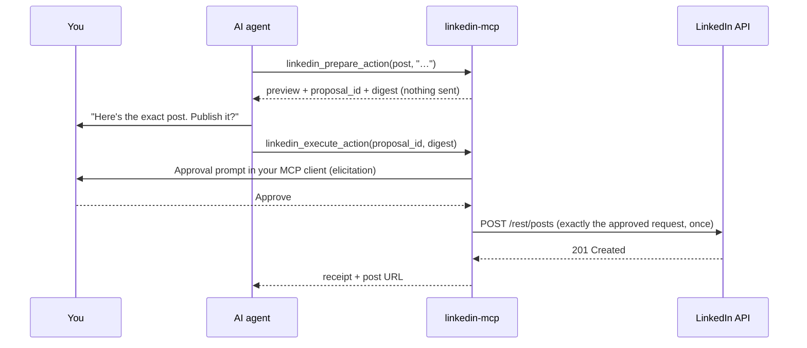

# linkedin-mcp

**Approval-gated LinkedIn tools for any MCP-compatible AI agent.**

`linkedin-mcp` is a [Model Context Protocol](https://modelcontextprotocol.io) server that lets AI agents (Claude Desktop, Claude Code, Cursor, or your own agent framework) publish to LinkedIn on your behalf, **without ever posting something you didn't approve**.

It uses LinkedIn's **official OAuth API**, has **zero third-party dependencies**, and puts a human-in-the-loop safety layer in front of every write.


---

## Why

Giving an autonomous agent write access to your professional profile is risky. Models hallucinate, retry on errors, and can be steered by prompt injection. This server is built around one rule:

> **The agent can propose. Only you can publish.**

Every LinkedIn write is split into two phases:

1. **Prepare.** The agent calls `linkedin_prepare_action`. The server builds the *exact* HTTP request LinkedIn will receive, stores it, and returns a human-readable preview plus a SHA-256 digest. Nothing is sent.
2. **Execute.** After you approve that exact preview, the agent calls `linkedin_execute_action` with the proposal ID and digest. The server re-verifies everything and sends the request **once**.



## Features

- **Publishing:** text posts and link-card posts, with `PUBLIC` or `CONNECTIONS` visibility.
- **Engagement:** comment on a post, or react to it (Like, Celebrate, Support, Insightful, Love, Funny).
- **Cleanup:** delete a post you published.
- **Human-in-the-loop by design:**
  - **Approval asked by the server:** when your client supports MCP elicitation, the server itself asks *you* to confirm, so the model cannot approve its own action.
  - **Exact-match approval:** the digest binds the request body, endpoint and LinkedIn account. If anything changes after preparation, execution is refused.
  - **Single-use, expiring proposals:** 30 minutes by default. A proposal is consumed *before* the network call.
  - **Never double-posts:** network errors, timeouts and 5xx responses are recorded as `unknown` and never retried. The same action can't be re-prepared for 24 hours.
  - **Daily write cap:** 40 a day by default, below LinkedIn's member limits.
- **Private local state:** the token and proposals live in `~/.linkedin-mcp`, created `0700`. Files are `0600` and written atomically, and the server refuses files other users could have tampered with.
- **Zero dependencies:** pure Python standard library, Python 3.9+.

## Quick start

### 1. Create a LinkedIn developer app (5 minutes, free)

1. Go to <https://www.linkedin.com/developers/apps> and click **Create app**. You'll need a LinkedIn Page to associate it with; any page you manage works.
2. Under **Products**, add **Share on LinkedIn** and **Sign In with LinkedIn using OpenID Connect**.
3. Under **Auth → Authorized redirect URLs**, add: `http://localhost:8765/callback`
4. Copy the **Client ID** and **Client Secret**.

### 2. Install and connect your account

With [uv](https://docs.astral.sh/uv/) (recommended):

```bash
export LINKEDIN_CLIENT_ID="your-client-id"
export LINKEDIN_CLIENT_SECRET="your-client-secret"
uvx --from git+https://github.com/PeterEkwere/linkedin-mcp linkedin-mcp login
```

Or with pip:

```bash
pip install git+https://github.com/PeterEkwere/linkedin-mcp
linkedin-mcp login
```

Your browser opens LinkedIn's consent screen. After you allow access, the token is saved to `~/.linkedin-mcp/token.json`. The client ID and secret are only needed for `login`, not for running the server.

On a headless server, use `linkedin-mcp login --paste` and paste the redirect URL back into the terminal.

### 3. Add it to your agent

**Claude Code**

```bash
claude mcp add linkedin -- uvx --from git+https://github.com/PeterEkwere/linkedin-mcp linkedin-mcp
```

**Claude Desktop** (`claude_desktop_config.json`) and **Cursor** (`~/.cursor/mcp.json`)

```json
{
  "mcpServers": {
    "linkedin": {
      "command": "uvx",
      "args": ["--from", "git+https://github.com/PeterEkwere/linkedin-mcp", "linkedin-mcp"]
    }
  }
}
```

**Any other MCP client or custom agent:** launch `linkedin-mcp` (or `python -m linkedin_mcp`) as a **stdio** server.

> ⚠️ Never put `linkedin_execute_action` on an auto-approve or always-allow list. In clients without elicitation support, the client's own "allow this tool call?" prompt *is* your approval step.

### 4. Try it

> *"Draft a LinkedIn post announcing that I just open-sourced linkedin-mcp, show it to me, and publish it if I approve."*

## Tools

| Tool | Writes to LinkedIn? | Purpose |
|---|---|---|
| `linkedin_status` | No | Connected member, token days left, writes today, approval mode, capabilities |
| `linkedin_prepare_action` | No | Build and store an exact action; returns `preview`, `proposal_id`, `digest` |
| `linkedin_execute_action` | **Yes, once** | Perform a prepared action after approval; returns a receipt (and post URL) |
| `linkedin_list_actions` | No | `pending` proposals awaiting approval, or `recent` actions with receipts |
| `linkedin_cancel_action` | No | Permanently cancel a pending proposal |

`linkedin_prepare_action` arguments:

| `kind` | Required | Optional |
|---|---|---|
| `post` | `text` (≤ 3,000 chars) | `visibility` (`PUBLIC` \| `CONNECTIONS`), `link_url` (https), `link_title`, `link_description` |
| `comment` | `post_url`, `text` (≤ 1,250 chars) | none |
| `react` | `post_url` | `reaction`: `LIKE`, `PRAISE`, `EMPATHY`, `INTEREST`, `APPRECIATION`, `ENTERTAINMENT` |
| `delete_post` | `post_url` (share/ugcPost URN returned on publish) | none |

`post_url` accepts a LinkedIn post URL or a URN such as `urn:li:share:7123…`.

Tools carry MCP annotations (`readOnlyHint`, `destructiveHint`, `openWorldHint`), so clients can show risk levels.

## Approval modes

Set with `LINKEDIN_MCP_APPROVAL`:

| Mode | Behaviour |
|---|---|
| `auto` (default) | Uses **elicitation** if the client supports it; otherwise relies on the client's tool-call confirmation |
| `elicit` | **Strict:** the server must ask you itself. Execution is refused on clients without elicitation support |
| `client` | Never elicits; relies entirely on the client's per-tool confirmation |

## Configuration

| Variable | Default | Description |
|---|---|---|
| `LINKEDIN_CLIENT_ID` / `LINKEDIN_CLIENT_SECRET` | none | Your LinkedIn app credentials (used by `login` only) |
| `LINKEDIN_MCP_HOME` | `~/.linkedin-mcp` | Private state directory (token, proposals, usage) |
| `LINKEDIN_MCP_APPROVAL` | `auto` | `auto`, `elicit` or `client` (see above) |
| `LINKEDIN_MCP_DAILY_WRITE_CAP` | `40` | Maximum LinkedIn writes per UTC day |
| `LINKEDIN_MCP_PROPOSAL_TTL` | `1800` | Seconds before an unapproved proposal expires |
| `LINKEDIN_MCP_REDIRECT_PORT` | `8765` | Local OAuth callback port (must match your app's redirect URL) |
| `LINKEDIN_API_VERSION` | `202608` | LinkedIn REST API version header (`YYYYMM`) |

## CLI

```text
linkedin-mcp            # run the MCP server on stdio (what your client launches)
linkedin-mcp login      # connect your LinkedIn account (OAuth)
linkedin-mcp status     # show connection, token expiry and today's usage
linkedin-mcp logout     # delete the stored token
```

## Security model

| Threat | Mitigation |
|---|---|
| Model publishes without consent | Two-phase writes; server-side elicitation approval; execute tool marked destructive |
| Prompt injection alters content after approval | Digest over the exact request + account; recomputed at execution |
| Agent retries and double-posts | Proposal consumed before sending; uncertain results never retried; 24 h duplicate block |
| Runaway agent loops | Daily write cap; proposals expire |
| Token theft on shared machines | Token in a `0700` directory as a `0600` file; tampered or loosely-permissioned files rejected |
| Redirect or open-redirect tricks | API client refuses HTTP redirects; OAuth `state` verified |

## Limitations

- **What LinkedIn's API allows:** reading your feed, inbox, connections or search, and sending messages or invitations, aren't available to self-serve apps, so this server doesn't offer them. `linkedin_status` says so.
- **Token renewal:** member tokens last about **60 days**, with no refresh token for self-serve apps. Run `linkedin-mcp login` again when `linkedin_status` shows few days left.
- **Single LinkedIn account:** one account per state directory. Use separate `LINKEDIN_MCP_HOME` values for multiple accounts.

## Development

```bash
git clone https://github.com/PeterEkwere/linkedin-mcp && cd linkedin-mcp
pip install -e .
python -m unittest discover -s tests -v
```

The tests cover request building and validation, the proposal lifecycle (exact-match, single-use, expiry, tamper detection, no-retry on uncertain outcomes, daily cap), private storage, OAuth state checks, and the MCP handshake including elicitation approve and decline flows.

## Browser module (optional, self-hosted)

LinkedIn's open API cannot read your inbox, so there is a separate opt-in module
that drives a real Chrome session logged in as you and reads your own messages.
You log in once through a VNC screen reached over an SSH tunnel, and the session
is saved in a local Chrome profile.

```bash
pip install "linkedin-mcp[browser] @ git+https://github.com/PeterEkwere/linkedin-mcp"
linkedin-mcp-browser worker        # owns Chrome, listens on a local socket
linkedin-mcp-browser login         # one-time login over an SSH-tunnelled VNC screen
linkedin-mcp-browser mcp           # MCP front end your agent connects to
```

Tools (all read-only): `linkedin_browser_status`, `linkedin_list_conversations`,
`linkedin_read_conversation`.

Full VPS setup, the VNC login flow, a systemd service and the security notes are
in [docs/VPS_DEPLOYMENT.md](docs/VPS_DEPLOYMENT.md).

> **Heads up:** automating the LinkedIn website is against LinkedIn's User
> Agreement and can get your account restricted. Use it only on your own account,
> at low volume. This module does not try to defeat bot detection, and it is not
> for scraping people at scale or for bulk outreach. Sending messages is
> deliberately not part of it; posting stays in the approval-gated official-API
> server above.

## Roadmap

- Streamable HTTP transport for remote and hosted agents
- Image and document posts

## Background

`linkedin-mcp` began as the LinkedIn layer of **Grace**, my personal multi-agent assistant, where approvals happen over WhatsApp. This repository is the standalone, client-agnostic version of its official-API tools.

## License

MIT © Peter Udeme Ekwere
